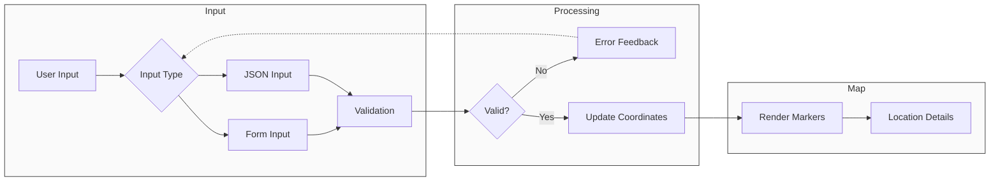

# Atlas Quest

A React-based web application that allows users to plot and visualize coordinates within the continental United States using Google Maps. The application supports both form-based and JSON input methods, with real-time validation and reverse geocoding features.

[](https://atlas-quest.vercel.app)

# Images


Video Demo : https://drive.google.com/file/d/15Gn54zcbg3mE3QsH79hnoWypChXbRnKV/view?usp=sharing


## Table of Contents
- [Component Architecture](#component-architecture)
- [Features](#features)
- [Prerequisites](#prerequisites)
- [Installation](#installation)
- [Environment Variables](#environment-variables)
- [Usage](#usage)
  - [Form Input](#form-input)
  - [JSON Input](#json-input)
- [Validation](#validation)
- [Contributing](#contributing)

## Component Architecture



## Features

- Interactive map visualization using Google Maps API
- Dual input methods:
  - Form-based coordinate input
  - JSON-based bulk coordinate input
- Real-time coordinate validation
- Reverse geocoding for location details
- US continental bounds enforcement
- Responsive design with Tailwind CSS
- Ad blocker detection
- Interactive markers with info windows

## Prerequisites

- Node.js (v14 or higher)
- npm or yarn
- Google Maps API key
- Modern web browser

## Installation

1. Clone the repository:
```bash
git clone https://github.com/vishdadhich092004/AtlasQuest
cd client
```

2. Install dependencies:
```bash
npm install
```

3. Create a `.env` file in the root directory and add your Google Maps API credentials:
```env
VITE_GOOGLE_MAPS_API_KEY=your_api_key_here
VITE_MAP_ID=your_map_id_here
```

4. Start the development server:
```bash
npm run dev
```

## Environment Variables

| Variable | Description | Required |
|----------|-------------|----------|
| `VITE_GOOGLE_MAPS_API_KEY` | Google Maps API key for map functionality | Yes |
| `VITE_MAP_ID` | Google Maps Map ID for styling | Yes |

## Usage

### Form Input
1. Enter latitude and longitude values within US continental bounds
2. Add multiple locations using the "Add Location" button
3. Click "Update Map" to visualize coordinates
4. Click on markers to view location details

### JSON Input
Submit coordinates in the following format:
```json
[
  {"latitude": 40.7128, "longitude": -74.0060},
  {"latitude": 34.0522, "longitude": -118.2437}
]
```


## Validation

The application enforces the following validation rules:

- Latitude must be between 24.396308° and 49.384358° (US continental bounds)
- Longitude must be between -125.000000° and -66.934570° (US continental bounds)
- All coordinates must be valid numbers
- JSON input must follow the specified format
- At least one coordinate pair is required

## Live Demo

The API is deployed and accessible at: [atlast-quest](https://atlas-quest.vercel.app)

## Contributing

1. Fork the repository
2. Create your feature branch (`git checkout -b feature/amazing-feature`)
3. Commit your changes (`git commit -m 'Add some amazing feature'`)
4. Push to the branch (`git push origin feature/amazing-feature`)
5. Open a Pull Request
